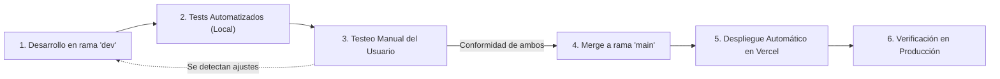

# Protocolo de Trabajo Git y Despliegue Continuo

Este documento establece el flujo de trabajo estándar para cualquier cambio, mejora o nueva funcionalidad en el proyecto **Concesionaria Premium / Alquiler**.

---

## 1. Estructura de Ramas (Git Flow)

- **`main`**: Rama de **Producción**.
  - Código estable y probado.
  - Cada `push` a esta rama dispara automáticamente el despliegue a la URL de producción en Vercel (`https://alquiler-inky.vercel.app`).
  - **Prohibido realizar commits directos sin pasar por el proceso de validación.**
- **`dev`**: Rama de **Desarrollo y Pruebas**.
  - Todas las nuevas características, páginas, correcciones o módulos se inician y desarrollan aquí.
  - Es el entorno de integración donde se ejecutan los tests automatizados y el testeo manual.

---

## 2. Ciclo de Vida de una Nueva Implementación



### Paso 1: Desarrollo en rama `dev`
- Asegurarse de estar en la rama correcta:
  ```bash
  git checkout dev
  git pull origin dev
  ```
- Implementar la funcionalidad respetando el estricto modo TypeScript, componentes tipados y design tokens del proyecto.

### Paso 2: Batería de Tests Automatizados (Local)
Antes de solicitar revisión humana, deben ejecutarse y aprobarse 3 verificaciones obligatorias:
1. **Comprobación de tipos TypeScript:**
   ```bash
   pnpm type-check
   ```
2. **Suite de pruebas unitarias:**
   ```bash
   pnpm test
   ```
3. **Compilación de producción Next.js (Turbopack):**
   ```bash
   pnpm build
   ```
*Si alguno de estos comandos falla, se debe corregir el código en `dev` antes de continuar.*

### Paso 3: Testeo Manual del Usuario
- El desarrollador/asistente notifica al usuario que la implementación está lista y los tests automatizados pasaron al 100%.
- Se proporciona la guía exacta de cómo probar la funcionalidad en el servidor de desarrollo (`pnpm dev`) o en preview.
- El usuario realiza las pruebas manuales en su navegador y valida que la interfaz, funcionalidad y experiencia cumplan con sus expectativas.

### Paso 4: Aprobación y Pase a Producción (`main`)
Una vez obtenida la **conformidad mutua**:
1. Cambiar a la rama `main` y traer los últimos cambios:
   ```bash
   git checkout main
   git pull origin main
   ```
2. Realizar el merge de `dev` hacia `main`:
   ```bash
   git merge dev
   ```
3. Enviar a GitHub:
   ```bash
   git push origin main
   ```

### Paso 5: Despliegue Automático y Verificación
- Vercel detecta el push en `main` y construye la nueva versión en la nube.
- Se verifica el estado HTTP y la funcionalidad directamente en la URL pública: [https://alquiler-inky.vercel.app](https://alquiler-inky.vercel.app).
- Se regresa el entorno de trabajo local a la rama `dev`:
  ```bash
  git checkout dev
  ```
